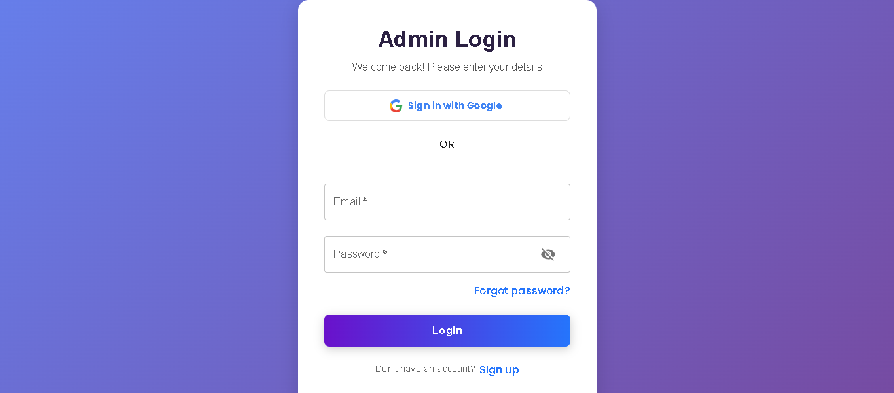
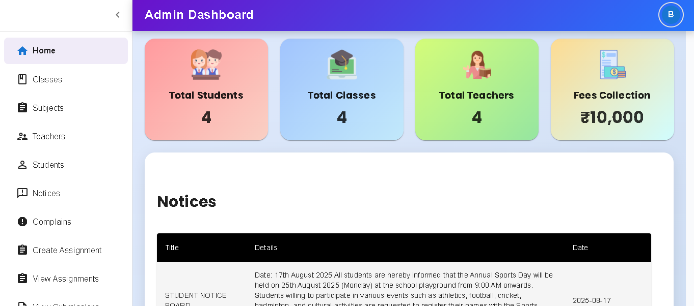
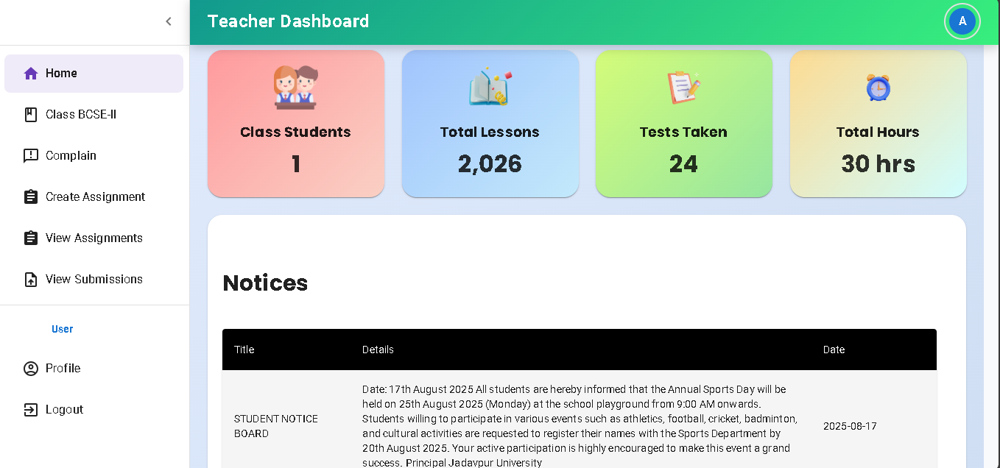
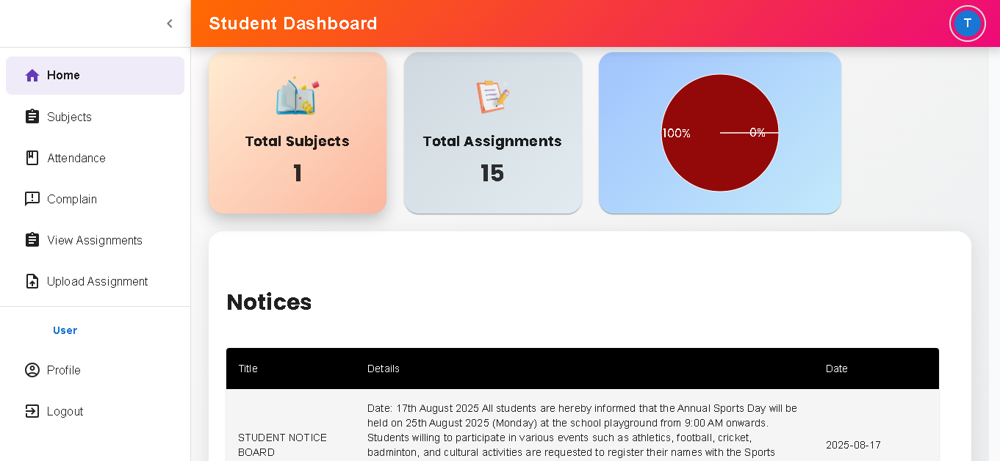

# SCHOOL MANAGEMENT SYSTEM

## Overview

A full-stack web application built with the **MERN** stack (MongoDB, Express.js, React.js, Node.js) to streamline school operations including managing students, faculty, attendance, performance tracking, and communication.

---

## 🔗 Live Demo 
 https://edumatrixf.onrender.com

---

## 🚀 Features

### 👤 User Roles & Authentication
- **Admin:** Full system access - create and manage students, teachers, classes, subjects, generate reports
- **Teacher:** View assigned classes, mark attendance, assign grades, create and grade assignments
- **Student:** View attendance, grades, assignments, submit work, communicate with teachers
- **Google OAuth Integration** for seamless authentication
- **JWT-based authentication** for secure API access

### 📚 Core Functionalities
- **Dashboard:** Role-specific overview with key metrics and quick actions
- **Student Management:** Complete CRUD operations for student profiles
- **Faculty Management:** Teacher profile management and assignment to classes
- **Attendance System:** Daily tracking with visual reports and analytics
- **Gradebook:** Marks management with performance trends visualization
- **Assignment System:** Create, distribute, submit, and grade assignments
- **Notice Board:** School announcements and important information
- **Communication:** Internal messaging system between users
- **Complaint System:** Issue reporting and resolution tracking

### 📊 Advanced Features
- Data visualization through interactive charts and graphs
- Responsive design optimized for desktop, tablet, and mobile
- Export functionality for reports and data
- Search and filtering across all data entities
- Real-time notifications for important events

---

## 🛠 Technology Stack

### Frontend
- **React.js** with Hooks for UI components
- **Redux** for state management
- **Material-UI** for responsive design components
- **Chart.js** for data visualization
- **React Router** for navigation

### Backend
- **Node.js** runtime environment
- **Express.js** web application framework
- **MongoDB** with Mongoose ODM for database
- **JWT** for authentication
- **Nodemailer** for email functionality
- **Bcrypt** for password hashing

### Deployment & Development
- **Render** for hosting both frontend and backend
- **MongoDB Atlas** for cloud database
- **Git** for version control


## 📦 Installation & Setup

### Prerequisites
- Node.js (v14 or higher)
- MongoDB Atlas account or local MongoDB installation
- Git

### Clone the Repository:
```bash
git clone https://github.com/binoysaren/edumatrix.git
cd edumatrix
```
Terminal 1: Backend Setup:
```bash
cd backend
npm install
```
Create a `.env` file in the `backend` folder and add:
  ```env
PORT=5000
MONGO_URL=your-mongodb-uri
JWT_SECRET=your-secret-key
  
GOOGLE_CLIENT_ID=your-google-client-id
GOOGLE_CLIENT_SECRET=your-google-client-secret
  
EMAIL=your-email@gmail.com
EMAIL_PASS=your-app-password
  
CLIENT_URL=http://localhost:3000

```
Start the backend server:
```bash
npm start
```
### Terminal 2: Frontend Setup
```bash
cd frontend
npm install
```
Create a `.env` file in the `frontend` folder and add:
 ```env
REACT_APP_BASE_URL=http://localhost:5000
SKIP_PREFLIGHT_CHECK=true
REACT_APP_GOOGLE_CLIENT_ID=your-google-client-id
```
Run frontend:
```bash
npm start
```
🚀 Running the Project

Start backend → runs on:
```bash
 http://localhost:5000
```

Start frontend → open in browser: 
```bash
http://localhost:3000
```
## ⭐ Final Notes

* Always start by signing up.
* Ensure backend is running before frontend.
* For MongoDB Atlas, whitelist your IP and enable network access.
For production:
     * Backend deploy: Render / Railway 
     * Frontend deploy: Netlify / Vercel / Render static site

---
## 📸 Screenshots

### 🔐 Login Page  


### 🏠 Dashboard (Admin)  


### 👨‍🏫 Teacher Panel  


### 👩‍🎓 Student Panel  



